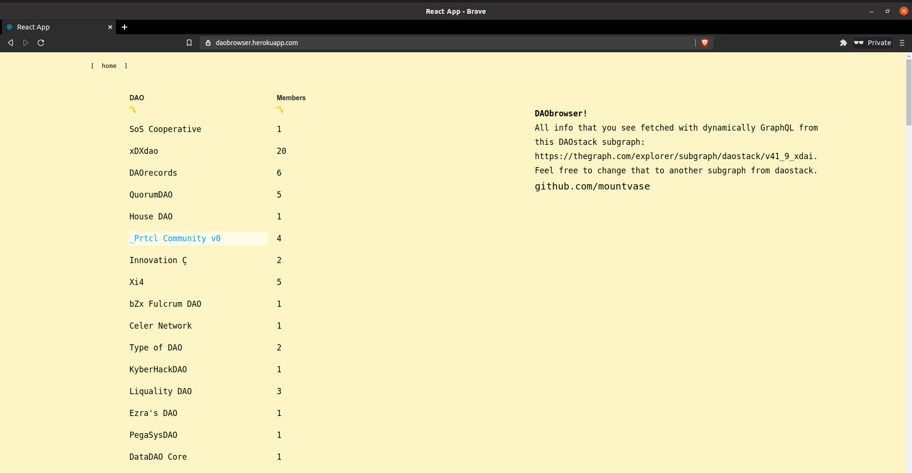
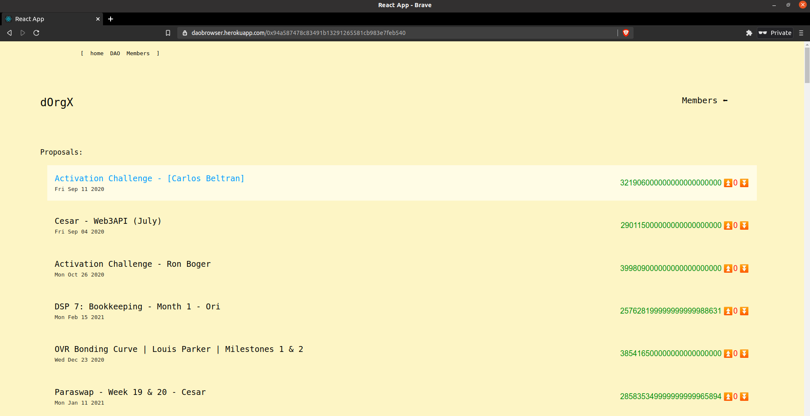
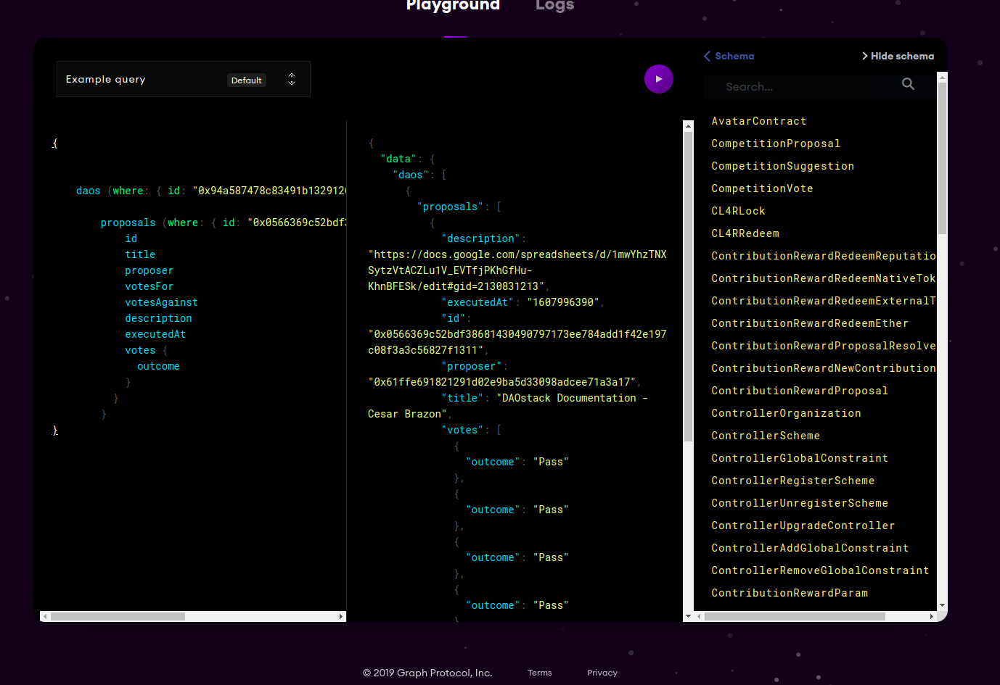

# DAObrowser

Part of dORGs activation challenge. [> dORG](https://dorg.tech/)

**deployed at [daobrowser.herokuapp.com/](https://daobrowser.herokuapp.com/)**

### Time Frame

~12 hours.

### Features

Ability to browse DAOs from daostack subgraph, filter by member size.
View specific DAOs proposals, their voting stats, descriptions. Members can also be browsed.

Every page makes a separate graphQL query with *[apollo client](https://www.apollographql.com/docs/react/)* to subgraph. This happens surprisingly fast, and could probably be done in a single query in the beginning, and pass the fetched object into other components.

### Background

I've been fascinated by theGraph recently. Blockchain data is usually hard to search for, find, and/or manipulate, but with some smart indexing and a GraphQL API this is solved quite well. I like tinkering with how web3 fits into the frontend of things, and while browsing the Alchemy app I'd thought I'd make a DAO explorer/viewer utilizing theGraph.

**Motivation** 

A decentralized web3 collective seems like such a cool idea, that I have to try to join! Something about me, I'm a former finance student, turned full-stack dev now into everything web3. After participating in the AAVE marketmake hackathon, I'd like to get more involved in the space, and this seems like a great way to do that.

### Queries

Queries can be found in queries.js in /src folder.
GraphQL playground is a useful way to get familiar, and test out queries. [https://thegraph.com/explorer/subgraph/daostack/v41_9_xdai](https://thegraph.com/explorer/subgraph/daostack/v41_9_xdai)

> Here's one query that I used

### Styles

Styling is for now done with styled-components, and is quite clumsily stored in the same file as the components. I've placed them after the actual rendering components for now, which might clear things up or further complicate them depending on who you are :) 

### Thanks

Comments/Advice/Feedback is greatly appreciated, hit me up on Telegram if you got some! [telegram](https://t.me/marakuas)

#### Available Scripts

In the project directory, you can run:

#### `yarn start`

Runs the app in the development mode.\
Open [http://localhost:3000](http://localhost:3000) to view it in the browser.

The page will reload if you make edits.\
You will also see any lint errors in the console.